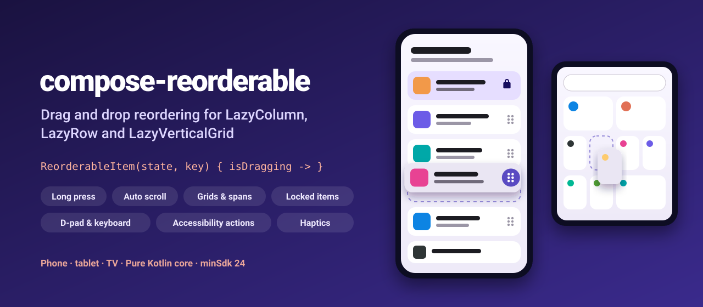
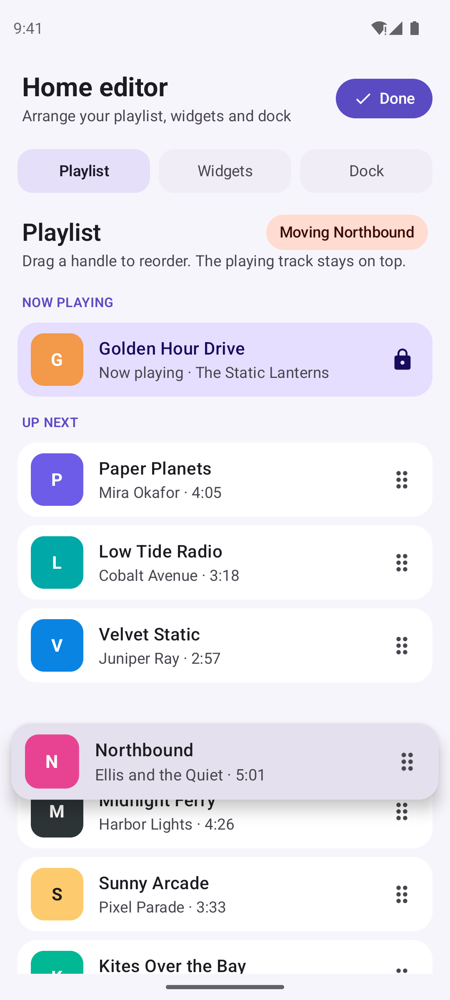
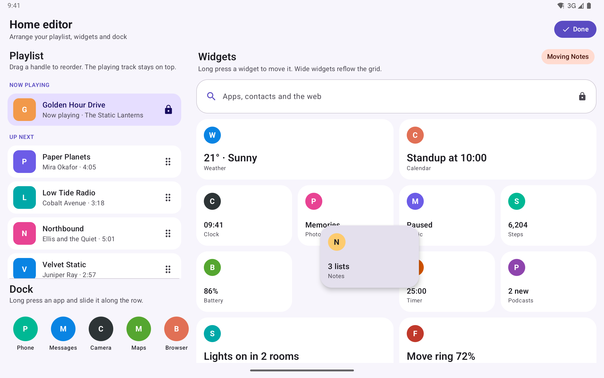
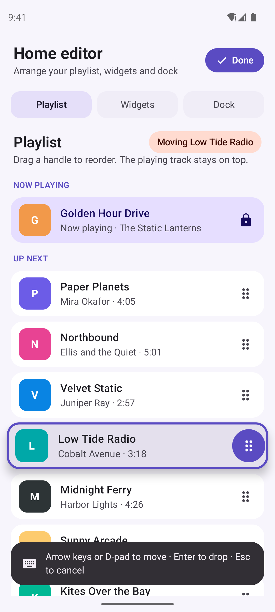
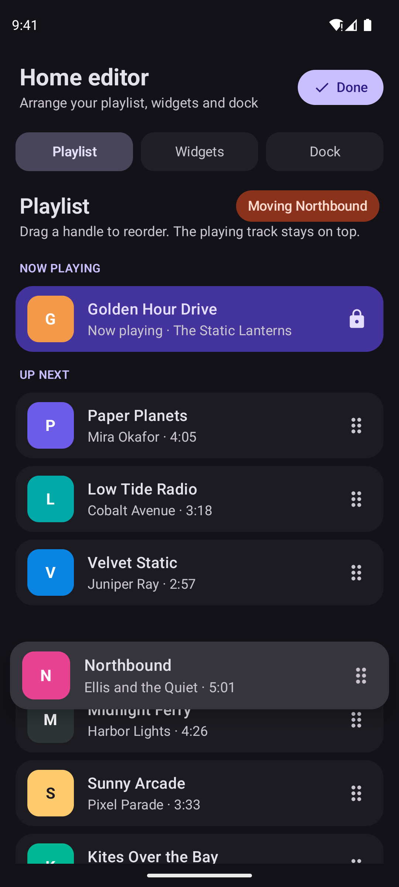
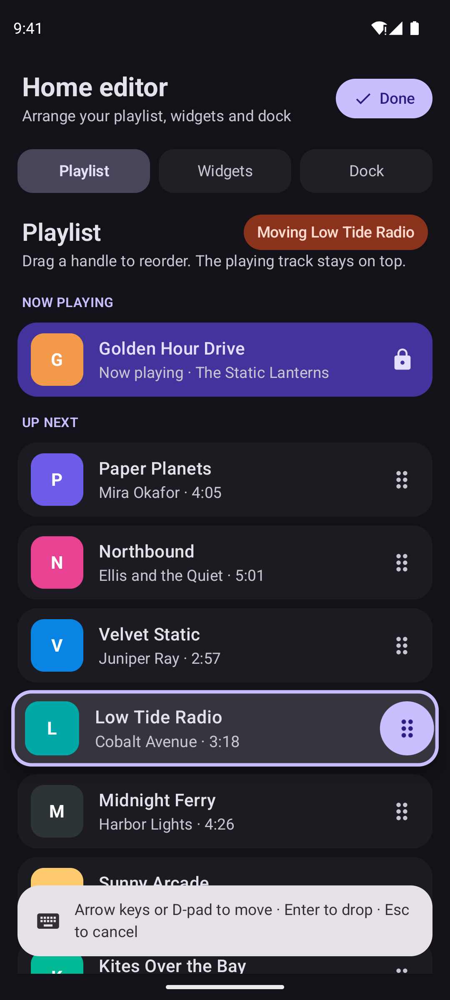
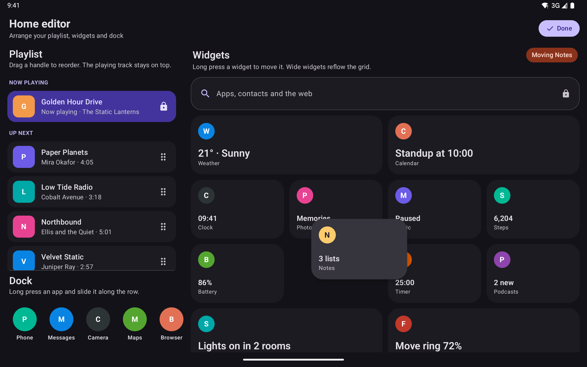

<p align="center">
  
</p>

<p align="center">
  <a href="https://github.com/halilozel1903/compose-reorderable/actions/workflows/ci.yml"></a>
  <a href="https://jitpack.io/#halilozel1903/compose-reorderable"></a>
  
  
  
  
  <a href="LICENSE"></a>
</p>

**compose-reorderable** adds drag and drop reordering to `LazyColumn`, `LazyRow` and `LazyVerticalGrid`. Wrap each item in `ReorderableItem`, put `Modifier.draggableHandle()` on a handle (or `longPressDraggableHandle()` on the whole item) and move your data in `onMove`. The dragged item lifts with an elevation and scale animation, the others slide out of its way, the list scrolls when you drag near an edge and the phone gives a haptic tick on every step. The same items can be reordered without a touchscreen: with the D-pad on a TV, the arrow keys on a hardware keyboard and the "Move up" / "Move to top" actions of TalkBack and Switch Access. The move logic lives in a small pure Kotlin module with unit tests.

```kotlin
val listState = rememberLazyListState()
val reorderState = rememberReorderableLazyListState(listState) { from, to ->
    tracks.move(from, to)
}

LazyColumn(state = listState) {
    items(tracks, key = { it.id }) { track ->
        ReorderableItem(reorderState, key = track.id) { isDragging ->
            TrackRow(track, handle = Modifier.draggableHandle())
        }
    }
}
```

## Screenshots

Captured from the sample app (a fictional home screen editor) on Android emulators by CI. An emulator in CI cannot drag, so each scene drives the reorder state from code and stops in the middle: one item lifted with its shadow, a gap where it will land.

**Phone, mid-drag:** a track lifted above the playlist, the gap where it will land, and the playing track pinned on top.



**Tablet, grid mid-drag:** the widgets grid with wide and small widgets; Notes is dragged into the next row and Battery's old spot is its gap. The playlist and the dock sit on the left.



| Keyboard / D-pad reorder mode | Phone mid-drag, dark | Keyboard mode, dark | Tablet grid, dark |
| :---: | :---: | :---: | :---: |
|  |  |  |  |

## Features

- **Lists and grids**: `LazyColumn`, `LazyRow`, `LazyVerticalGrid` (and `LazyHorizontalGrid`), with items of different sizes and grid spans. Works with `reverseLayout`, content padding, arrangements and right-to-left layouts.
- **Handles**: `Modifier.draggableHandle()` drags right away (a handle icon), `Modifier.longPressDraggableHandle()` waits for a long press so a swipe still scrolls (the whole item).
- **Lift animation**: the dragged item is drawn above the others with an animated shadow and scale, follows the finger exactly, and springs into its slot when dropped. The other items use `Modifier.animateItem()` to make room.
- **No flicker with different sizes**: an item takes another item's place only after passing its middle, so small items over big ones (and the other way around) never swap back and forth.
- **Auto scroll**: near the start or end of the list it scrolls, slowly at first and faster closer to the edge (an ease-in curve up to a maximum speed), only in the direction you are dragging.
- **Locked items**: `isLocked` pins items (a playing track, a search bar); they never move and nothing can be moved across them. Headers and disabled items are locked automatically.
- **Haptic feedback**: a long press tick when an item is picked up and a light tick on every move.
- **TV and hardware keyboards**: handles are focusable. Enter, Space or the D-pad center picks an item up, the arrow keys move it (up and down in a column, left and right in a row, all four in a grid), Enter drops it and Escape puts it back. Ctrl + arrow keys move the focused item directly.
- **Accessibility**: each item gets custom actions with clear labels: "Move to top", "Move up", "Move down", "Move to bottom" (or "Move left", "Move right", "Move to start", "Move to end" in a row, all of them in a grid). Only possible moves are listed. Labels are replaceable for translations.
- **Programmatic control**: `startDrag`, `dragBy`, `endDrag`, `cancelDrag`, `startKeyboardReorder` and `move(key, action)` for tests, demos and screenshots.
- **Pure Kotlin core** (`compose-reorderable-core`): list moves, locked item rules, drop target computation for lists and grids, auto-scroll speed, keyboard moves and labels, unit tested and usable from any JVM module.

## Installation

Add JitPack to `settings.gradle.kts`:

```kotlin
dependencyResolutionManagement {
    repositories {
        google()
        mavenCentral()
        maven("https://jitpack.io")
    }
}
```

Then the dependency:

```kotlin
dependencies {
    implementation("com.github.halilozel1903.compose-reorderable:compose-reorderable:1.0.0")
    // Pure Kotlin move logic only (for JVM/KMP modules or your own drag and drop):
    // implementation("com.github.halilozel1903.compose-reorderable:compose-reorderable-core:1.0.0")
}
```

> The build is also set up for Maven Central (`io.github.halilozel1903:compose-reorderable`) via the vanniktech publish plugin.

## Usage

**A list with handles**

```kotlin
val tracks = remember { mutableStateListOf(*allTracks.toTypedArray()) }
val listState = rememberLazyListState()
val reorderState = rememberReorderableLazyListState(
    lazyListState = listState,
    onDragStopped = { from, to -> saveOrder(tracks) },     // a good moment to persist
) { from, to ->
    tracks.move(from, to)                                   // from reorderable-core
}

LazyColumn(state = listState, verticalArrangement = Arrangement.spacedBy(8.dp)) {
    items(tracks, key = { it.id }) { track ->
        ReorderableItem(reorderState, key = track.id, shape = RoundedCornerShape(16.dp)) { isDragging ->
            Card {
                Row(verticalAlignment = Alignment.CenterVertically) {
                    Text(track.title, Modifier.weight(1f))
                    Icon(DragIndicator, contentDescription = "Reorder", modifier = Modifier.draggableHandle())
                }
            }
        }
    }
}
```

`onMove` gets lazy layout indices. Items keep their composition while they move, so always pass the list's `key` to `ReorderableItem` as well. With items before your data (headers, labels), subtract them: `tracks.move(from - 1, to - 1)`.

**A grid with long press**

```kotlin
val gridState = rememberLazyGridState()
val reorderState = rememberReorderableLazyGridState(gridState) { from, to -> widgets.move(from, to) }

LazyVerticalGrid(columns = GridCells.Fixed(4), state = gridState) {
    items(widgets, key = { it.id }, span = { GridItemSpan(it.span) }) { widget ->
        ReorderableItem(reorderState, key = widget.id) { isDragging ->
            WidgetCard(widget, Modifier.longPressDraggableHandle())
        }
    }
}
```

**A row**

```kotlin
val rowState = rememberLazyListState()
val reorderState = rememberReorderableLazyListState(rowState) { from, to -> apps.move(from, to) }

LazyRow(state = rowState) {
    items(apps, key = { it.id }) { app ->
        ReorderableItem(reorderState, key = app.id) { isDragging ->
            AppIcon(app, Modifier.longPressDraggableHandle())
        }
    }
}
```

**Locked items**

```kotlin
val reorderState = rememberReorderableLazyListState(
    lazyListState = listState,
    isLocked = { index -> items[index].pinned },   // never moves, nothing moves across it
) { from, to -> items.move(from, to) }

ReorderableItem(reorderState, key = item.id, enabled = !item.pinned) { ... }   // no handle, no actions
```

**Look and feel**

```kotlin
ReorderableItem(
    state = reorderState,
    key = item.id,
    liftedElevation = 12.dp,                    // shadow while dragged (default 8.dp)
    liftedScale = 1.05f,                        // scale while dragged (default 1.03)
    shape = RoundedCornerShape(16.dp),          // shape of the shadow
    animateItemModifier = Modifier.animateItem(placementSpec = tween(150)),
) { isDragging ->
    Card(colors = if (isDragging) highlighted else normal) { ... }
}

rememberReorderableLazyListState(
    lazyListState = listState,
    autoScrollThreshold = 80.dp,                // start scrolling this close to an edge
    autoScrollMaxSpeed = 2000.dp,               // per second, at the edge
    hapticFeedbackEnabled = false,
) { from, to -> items.move(from, to) }
```

**TV, D-pad and hardware keyboards**

Nothing to add: handles are focusable. Focus a handle with the D-pad or Tab, press the center button or Enter to pick the item up, move it with the arrows and press Enter again to drop it (Escape cancels, Back drops). A `longPressDraggableHandle` picks the item up on a long press of the center button, so a short press still reaches a click handler. `isKeyboardReordering` in the item scope tells you to draw a highlight:

```kotlin
ReorderableItem(reorderState, key = item.id) { isDragging ->
    val handleInteractions = remember { MutableInteractionSource() }
    val handleFocused by handleInteractions.collectIsFocusedAsState()
    Card(border = if (isKeyboardReordering) BorderStroke(3.dp, Primary) else null) {
        Icon(DragIndicator, "Reorder", Modifier.draggableHandle(interactionSource = handleInteractions))
    }
}
```

Pass `keyboardReorder = false` to a handle to leave keys alone.

**Accessibility and translations**

TalkBack lists "Move up", "Move to top" and the other possible moves in its actions menu for every item. Provide translated labels once:

```kotlin
CompositionLocalProvider(
    LocalReorderLabels provides ReorderLabels(
        moveUp = stringResource(R.string.move_up),
        moveDown = stringResource(R.string.move_down),
        moveToTop = stringResource(R.string.move_to_top),
        moveToBottom = stringResource(R.string.move_to_bottom),
        reordering = stringResource(R.string.reordering),
    ),
) {
    PlaylistScreen()
}
```

**From code**

```kotlin
reorderState.startDrag(key)                         // lift a visible item
reorderState.dragBy(Offset(0f, 120f))               // move it; onMove is called as it passes items
reorderState.endDrag()                              // or cancelDrag() to put it back

reorderState.move(key, ReorderAction.MoveToTop)     // one move, as accessibility services do
reorderState.startKeyboardReorder(key)              // keyboard mode, as Enter on a handle does
reorderState.availableActions(key)                  // [MoveToTop -> 0, MoveUp -> 2, MoveDown -> 4, MoveToBottom -> 9]
reorderState.draggingKey                            // what is being dragged, for a "Moving ..." label
```

## The core module

`compose-reorderable-core` has no Android or Compose dependency. The composables are built on it, and you can use it for your own drag and drop or in tests:

```kotlin
listOf("a", "b", "c", "d").moved(from = 0, to = 2)              // [b, c, a, d]
songs.moveByKey(fromKey = 30, toKey = 10) { it.id }             // keyed moves

ReorderRules.reachableTarget(from = 2, to = 6) { it == 4 }      // 3: stops before the locked item

ReorderTargets.listTarget(draggedIndex = 1, draggedStart = 260f, draggedSize = 100f, items = spans)   // 3
ReorderTargets.gridTarget(draggedIndex = 4, dragged = rect, items = rects)                           // row by row, any spans

AutoScroll.speed(distanceToEdge = 20f, threshold = 100f, maxSpeed = 2000f)   // 1280 px/s (ease-in)
AutoScroll.velocity(itemStart, itemEnd, viewportStart, viewportEnd, threshold, maxSpeed)   // signed

ReorderNavigation.target(ReorderAction.MoveDown, index = 5, itemCount = 10, layout = ReorderLayout.grid(4))   // 9
ReorderNavigation.availableActions(index = 1, itemCount = 5, layout = ReorderLayout.VerticalList)
// [MoveUp -> 0, MoveDown -> 2, MoveToBottom -> 4] ("Move to top" would duplicate "Move up")
ReorderLabels.English.labelFor(ReorderAction.MoveToTop)          // "Move to top"
```

| API | What it does |
| --- | --- |
| `move`, `moved`, `moveByKey`, `movedByKey` | Move an item from one index (or key) to another in a list |
| `ReorderRules` | Locked items: how far an item can move, whether a move is allowed |
| `ReorderTargets`, `ItemSpan`, `ItemRect` | The drop target from the dragged item's position, for lists and row-major grids with any sizes |
| `AutoScroll` | Scroll speed from the distance to an edge (ease-in, max speed), signed velocity, per-frame delta |
| `ReorderNavigation`, `ReorderLayout`, `ReorderAction` | Keyboard, D-pad and accessibility moves for columns, rows and grids, RTL aware |
| `ReorderLabels` | "Move up", "Move to top"... and "Position 3 of 8", replaceable for translations |

## Sample app

The `sample` module is Home Editor, a fictional launcher's "edit home screen" page:

- **Playlist**: a `LazyColumn` with drag handles, labels before the tracks and the playing track pinned on top (`isLocked` plus a disabled item).
- **Widgets**: a `LazyVerticalGrid` with a locked full-width search bar, wide and small widgets, long press to drag.
- **Dock**: a `LazyRow` of apps, long press to drag.

Phones switch between them with tabs; tablets and TVs show all three at once. A header chip says what is moving.

Emulators in CI cannot drag, so the sample opens a fixed scene from an intent extra (used by `scripts/screenshots.sh`) and drives the state from code with the public API:

```bash
./gradlew :sample:installDebug
adb shell am start -n io.github.halilozel1903.reorderable.sample/.MainActivity --es scene list
```

`scene` is one of `list` (the playlist mid-drag), `grid` (the widgets grid mid-drag) or `dpad` (keyboard reorder mode). CI captures `grid` on a Pixel Tablet emulator in landscape and `list` and `dpad` on a Pixel 7, in light and dark mode, checks each capture for the scene's text and fails on blank images.

The sample also runs on Android TV (it declares the leanback launcher and does not require a touchscreen): move between handles with the D-pad and press the center button to reorder.

## Project structure

| Module | What it is |
| --- | --- |
| `reorderable-core` | Pure Kotlin: list moves, locked items, drop targets for lists and grids, auto-scroll speed, keyboard moves, labels. Published as `compose-reorderable-core` |
| `reorderable` | Compose: `rememberReorderableLazyListState`, `rememberReorderableLazyGridState`, `ReorderableItem`, `draggableHandle`, `longPressDraggableHandle`, `LocalReorderLabels`. Published as `compose-reorderable` |
| `sample` | Home Editor: a playlist, a widgets grid and a dock, with screenshot scenes |

## Tech stack

Kotlin 2.4 · AGP 9.4 with built-in Kotlin · Gradle 9.6 · Jetpack Compose (BOM 2026.09) · Material 3 (sample only) · `LazyListState` / `LazyGridState` layout info · `Modifier.animateItem` · pointer input and key events · semantics custom actions · GitHub Actions with Android emulators

## License

MIT. See [LICENSE](LICENSE).
